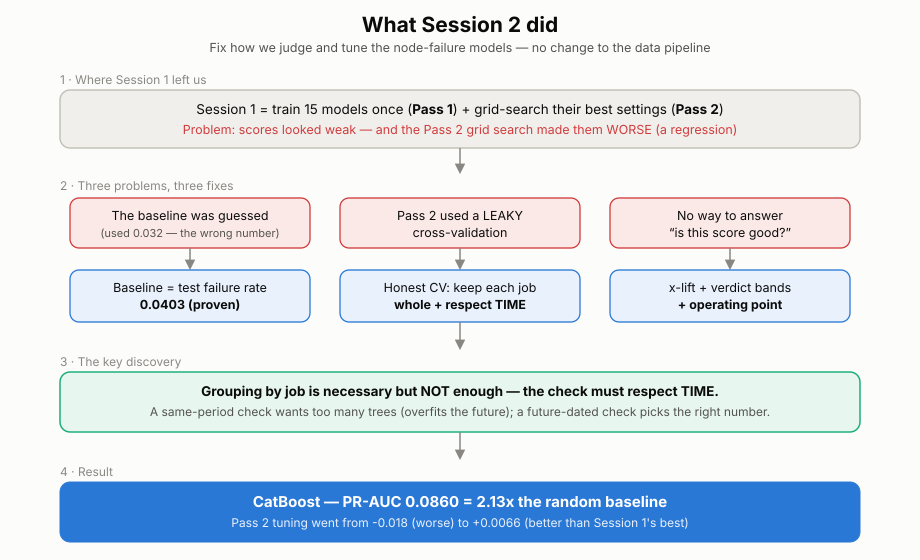

# Session 2 — one-page recap (start here)

_For anyone who hasn't been in the loop. Read this first, then the detailed
`session_2_methodology.md` (why) and `session_2_findings.md` (what)._

_(open `session_2_overview.svg` in a browser if the image doesn't render here.)_

---

## Words we keep using (so nobody gets lost)

- **Session 1** = the original benchmark. It had **two stages**:
  - **Pass 1** — train **15 different models** _once_, each with default settings, just to
    rank them and see which family is best.
  - **Pass 2** — take the top models and **grid-search their hyperparameters** (try many
    settings and keep the best). **"Pass 2" = the hyperparameter/grid search.**
- **Session 2** = _this_ work. We did **not** add new models or change the data. We fixed
  **how we judge** the scores and **how we tune** (re-did the Pass-2 search **the right
  way**), and we explained the results.
- **The task** = from a 10-minute window of a GPU node's metrics, predict whether the job is
  about to **fail**, early enough to drain the node. Failures are **rare** (~4% of windows),
  which makes the scores look small — see "how to read them" below.

## The one-paragraph story

Session 1's grid search (**Pass 2**) actually made the models **worse**, which was suspicious.
The cause was the **cross-validation** inside the grid search (explained below): it was
"cheating" because of how our data is built, so the search picked bad settings. In Session 2
we (1) pinned down the **correct baseline** to judge scores against, (2) rebuilt the
cross-validation so it can't cheat, and (3) discovered that it must respect **time**, not just
keep jobs together. Re-tuned properly, **CatBoost reaches PR-AUC 0.0860 = 2.13× the random
baseline** — better than Session 1's best, and the earlier regression is gone.

## What is cross-validation (CV)?

When we pick a model's settings, we must estimate **"how well will this do on data it hasn't
seen?"** — _without_ touching the final test set. **Cross-validation** does this by splitting
the **training** data into a few **folds**: train on some folds, check on the held-out fold,
rotate, average. The setting that scores best across folds is the one we keep.

**When does this happen?** _Only inside **Pass 2** (the grid search)._ Pass 1 trains each model
once and tests once — no CV. In Pass 2 the grid search uses CV on the **training** set to choose
hyperparameters. The final **test set is never part of the CV** (it's a later, separate set of
jobs), so it stays honest — which is exactly how we could _see_ the leak: CV claimed **0.46**,
the test delivered **0.08**.

**The catch for us.** Our rows are **overlapping 10-minute windows** of the same job (each
window shares 39 of its 40 snapshots with the next). If we split **randomly**, almost-identical
windows of one job land on **both** sides of the split — so the model "sees the answer" and the
CV score is fake-high. Pass 2 trusted that fake-high score and picked over-complex models →
the regression.

## A subtlety: what is a "positive"?

The models predict **windows**, so a **positive = a window whose label is 1** = a window in the
**final 2 h of a job that ultimately failed** (decided by _majority vote_ — ≥20 of its 40
snapshots are in that 2-h zone). Do **not** confuse it with: the **job's state** (used only for
the per-state breakdown), or the per-**snapshot** label (an intermediate step). This is why a
long TIMEOUT job is only ~10% positive windows (just its tail), while short OOM jobs are ~99%.
The baseline (0.0403) counts positive **windows**, because that is the unit the model is scored
on.

**The fix = better ways to split** (this is what "GroupKFold / TimeSeriesSplit / PurgedKFold"
are — they are **splitting rules, not models**):

- **GroupKFold** — put every window of a given **job** entirely on one side. Kills the
  overlap cheat.
- **TimeSeriesSplit / PurgedKFold** — split by **time**: train on the past, validate on the
  **future** (with a small gap so nothing bleeds across). This mimics real deployment.

We measured how much each splitter "cheats": the old random split overstates the score
**5.7×**; grouping cuts it to **2.7×**; only **time-aware** splitting is honest (**~1.1×**).
And we found that grouping alone isn't enough — you must respect **time** — which is the key
discovery in the diagram above.

## What to remember

1. Judge PR-AUC against the **baseline 0.0403** (the failure rate in the test set). Best model
   = **2.13×** that.
2. The old grid search (**Pass 2**) regressed because its **cross-validation leaked**; honest,
   **time-aware** CV fixes it.
3. **Recommended model: CatBoost**, reported at a recall-favoring threshold, with calibrated
   probabilities.
4. To go meaningfully higher we'd have to change the **data pipeline** (window size, features)
   — deliberately left for a later, separate session.
